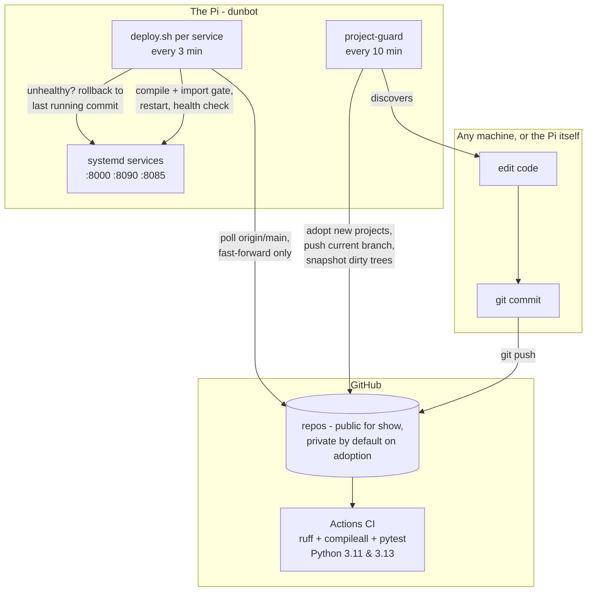

# pi-cicd


A self-hosted CI/CD and continuous-backup system for the Raspberry Pi
that runs my marine radio kiosk and home services. Every project on the
machine — whether I create it deliberately or a new directory appears —
is automatically versioned, CI-tested on GitHub, deployed to live
systemd services with health-checks and rollback, and continuously
backed up, committed work and work-in-progress alike.

This repo is the machinery itself: it runs in production on the Pi and
deploys the services listed at the bottom.

## The whole system



## The four components

| Component | What it does |
|---|---|
| **`project-guard`** | Watches `$HOME` every 10 min. Adopts unversioned project directories (git init + .gitignore + CI + private GitHub repo). Pushes unpushed commits. Snapshots uncommitted work to an `autosave` branch via a private git index — the working tree is never touched. |
| **`new-project`** | Scaffolds a project with the full pipeline from the first commit: Flask app, pytest suite, CI workflow, badge, GitHub repo, and with `--port` a systemd service plus CD wiring. |
| **`templates/`** | The pull-based deploy script every service carries: byte-compile and import gates before restart, health check after, automatic rollback to the previously running commit, flap guard, dirty-tree guard. Plus the standard CI workflow. |
| **`systemd/` units** | Timers driving the guard and per-service deploys. |
| **`pipeline-check`** | Hourly compliance audit via a Hermes cron job: verifies every project is versioned, pushed, CI-green and (for services) deployed at HEAD. Alerts to messaging when not; silent when all is green. |

## Why it is built this way

- **Pull-based deploys, no self-hosted runners.** The repos are public;
  a self-hosted runner on the Pi would let any fork PR execute arbitrary
  code on my LAN host. The Pi polls `origin/main` instead — fork branches
  can never reach it.
- **Deploys triggered by "what is running", not "what arrived".** A
  marker file (`.deployed_commit`) records the commit behind the live
  service. Any HEAD divergence restarts through the gate — so commits
  made directly on the Pi deploy too, not just pulls.
- **Backup and deploy are separate powers.** The guard only ever pushes
  (additive, safe). Only deploy.sh resets anything, and only ever
  fast-forward onto a clean tree.
- **Failure is loud and one-shot.** A commit that fails its health check
  rolls back and is never retried until something newer lands — no
  flapping.

The full reasoning, including the incidents that shaped each rule,
is in [docs/architecture.md](docs/architecture.md).

## Quickstart on a fresh Pi

```bash
sudo apt install gh && gh auth login
git clone https://github.com/pkia/pi-cicd && cd pi-cicd
./install.sh          # symlinks tools, installs timers, sets git identity
new-project my-app --port 8100   # zero to a running, deployed,
                                 # CI-backed service in about a minute
```

## What it runs in production

- [maritime-dashboard](https://github.com/pkia/maritime-dashboard) —
  AIS ship tracker + NOAA weather-satellite kiosk (RTL-SDR, skyfield)
- [project-hub](https://github.com/pkia/project-hub) — portal with live
  health of every service on the Pi
- [sat-audio](https://github.com/pkia/sat-audio),
  [ais_analysis](https://github.com/pkia/ais_analysis) and friends —
  adopted automatically, CI running, continuously backed up

## Repository layout

```
project-guard           adoption + autosave backup engine (bash, systemd-driven)
new-project             project scaffolder with pipeline from birth
pipeline-check          hourly compliance audit (run via Hermes cron, alerts-only)
templates/ci-flask.yml     standard CI workflow for adopted/scaffolded projects
templates/deploy.sh        parameterised pull-based deploy script (__NAME__/__PORT__)
templates/deploy.timer     matching systemd timer
systemd/                guard units
docs/architecture.md    design decisions and the incident log
install.sh              fresh-host installer
```
