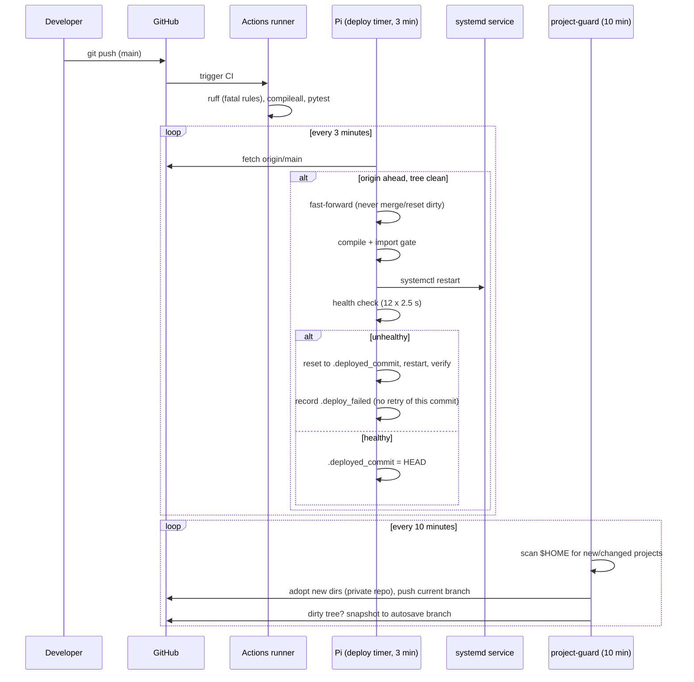

# Architecture

This document explains how the system works, why each piece is shaped
the way it is, and which real incidents produced which safety rule.
It is written to be read end-to-end; the code is small enough that this
doc plus the scripts is the whole system.

## Context

The host is a Raspberry Pi (`dunbot`) on a home LAN behind NAT, running
a marine-radio kiosk stack: an AIS receiver fed by an RTL-SDR dongle,
NOAA weather-satellite capture scheduled with skyfield, a Flask kiosk
dashboard on a touchscreen, and small utility services. Projects are
developed **directly on the Pi** as often as from a laptop, the repos
on GitHub are **public** (portfolio), and there is no inbound access to
the Pi from the internet. Those four facts drive every design decision.

## The pipeline, end to end

## Component design

### CI — GitHub-hosted runners only

Each repo carries `.github/workflows/ci.yml`: ruff restricted to fatal
rules (`E9,F63,F7,F82`) so lint never blocks on style, byte-compilation
of every source file, and a pytest suite that exercises real Flask
routes with the test client. The suites assert environment-agnostic
contracts (booleans stay booleans, endpoints answer without hardware)
so they pass identically on a GitHub runner and on the Pi, where the
SDR is attached and every port is live.

Self-hosted runners were rejected outright: on a public repo, any fork
PR is attacker-controlled workflow input, and the runner would execute
it on the LAN host with passwordless sudo. CI that must not touch the
host runs on GitHub's machines; anything that must touch the host runs
locally on a timer, reading only `origin/main`.

### CD — pull-based deploy with a "what is running" marker

Every service repo carries `deploy/deploy.sh` (generated from
`templates/deploy.sh`) plus a systemd timer firing every 3 minutes.
The script's contract:

1. **Sync** — fetch `origin/main`. If strictly behind and the tree is
   clean, `git reset --hard` (a fast-forward; unpushed local commits
   are ancestors and survive). If ahead: note and wait for a push. If
   diverged: refuse and log — a human decides.
2. **Deploy trigger** — read `.deployed_commit`. If it differs from
   HEAD, deploy — regardless of whether HEAD arrived by pull or by a
   local commit. This is what makes edit-on-the-Pi deploy automatically.
3. **Gate** — the incoming code must byte-compile and import cleanly
   with the project venv interpreter *before* any restart. A failure
   here never touches the running service.
4. **Restart + health check** — `systemctl restart`, then poll the
   service's port for up to 30 s.
5. **Rollback** — on failure, reset to the previously running commit,
   restart, verify. Record the failed commit in `.deploy_failed`; the
   flap guard refuses to retry that exact commit, so a bad release
   cannot oscillate every three minutes.

Invariants worth stating plainly: only `origin/main` is ever deployed
(PR branches never execute on the host); the working tree is never
reset while dirty; a deploy is idempotent (same marker, no action).

### project-guard — the "no work is lost" engine

A oneshot systemd unit every 10 minutes. For each project directory
under `$HOME` (and `$HOME/apps/*`):

- **No git repo but contains code** → adopt: `git init`, a `.gitignore`
  that starts from hygiene rules plus every file over 20 MB found
  anywhere in the tree, the standard CI workflow, an initial commit,
  a **private** GitHub repo. Public visibility is a deliberate later
  act (`gh repo edit NAME --visibility public`).
- **Hard size gate** — after staging, any file over 50 MB aborts the
  adoption. This is the backstop that does not depend on the ignore
  file being right.
- **Repo with unpushed commits** → push the current branch under its
  own name (projects may use `master` or feature branches; deploys
  target `main` deliberately, backups should capture what is real).
- **Dirty working tree** → snapshot to `autosave` using a private
  index: read HEAD's tree into a temp index file, `git add -A` against
  it, `write-tree`, `commit-tree` onto the autosave chain, push. The
  working tree, the real index, and HEAD are untouched — a save can
  never collide with an edit in progress.
- **Secrets gate** — before any push of new content, changed paths are
  checked for key/token/credential-looking names and content patterns
  (`ghp_…`, `sk-…`, `AKIA…`, private key headers, …). Suspect files are
  skipped and logged, never pushed. Best-effort by design; adoption
  defaults to private precisely because heuristics are not proof.
- **Never destructive** — the guard pushes only. It never pulls,
  merges, rebases or resets. Backup and deploy are separate powers
  held by separate scripts.

### new-project — pipeline from birth

Scaffolds a Flask app with tests that pass on any host, the CI
workflow, a README whose badge points at the real account, and a
GitHub repo (private by default). With `--port N` it also creates the
venv, the app's systemd unit, the deploy script + timer, starts the
service, and health-checks it — one command from empty directory to a
deployed, CI-backed service.

## Incident log

Real failures from this system's first day of life, and the rules they
produced. Kept honest on purpose.

**1. Uncommitted live fix nearly clobbered by a deploy.** While wiring
the first deploy pipeline, `noaa_scheduler.py` on the live Pi had
uncommitted SDR-contention fixes; a `git reset --hard origin/main`
would have destroyed them. → *Deploy refuses to run on a dirty tree;
marker-based deploys; the guard exists so uncommitted work is never
more than 10 minutes from safety.*

**2. Hardcoded home path broke the app everywhere except the Pi.** The
first GitHub CI run failed: the dashboard wrote a trigger file to
`/home/ev/maritime-dashboard/...` and 500'd on the runner. CI catching
a portability bug on its very first run is the strongest argument for
the whole pipeline. → *All runtime paths resolve from `BASE_DIR`;
tests assert environment-agnostic contracts.*

**3. The 349 MB adoption.** A brace-group with `>> file 2>/dev/null ||
cp /dev/null file` — a "fallback" that *truncates* — combined with
`pipefail` in the invoking shell, produced an empty `.gitignore`. The
guard then committed a 349 MB SDR capture; GitHub rejected the push at
its 100 MB limit, once, after uploading it. → *No truncating fallbacks
ever; config files written by heredoc and verified non-empty; oversized
files ignored at any depth; hard 50 MB gate on staged files.*

**4. Pushes hardcoded to `main` vs a `master` project.** A repo created
before `init.defaultBranch main` produced "src refspec main does not
match any" every cycle. → *Backup pushes the current branch by name;
detached HEAD (a rollback window) is skipped with a note.*

**5. Adoption of a container directory.** The scanner matched
`~/apps` (which merely *contained* projects) as a project itself.
→ *Container directories are skipped; their children are scanned.*

**6. CI template failed on repos without requirements.txt.**
`[ -f requirements.txt ] && pip install …` as the last line of a step
exits 1 when the file is absent. → *Conditionals in workflows use
`if`, never bare `&&` chains.*

## Failure modes accepted

- A deploy of a commit that passes compile/import but is logically
  broken rolls back within ~30 s; the bad commit stays on main and is
  marked `.deploy_failed` — fixing forward requires a new commit, by
  design.
- The secrets gate is heuristic; its job is stopping accidents, not
  adversaries. Privacy-by-default on adoption is the structural
  control.
- Autosave branches accumulate snapshot history in public repos for
  public projects; that is the accepted trade for never losing work.
  (Prune with `git push origin --delete autosave` when desired.)
